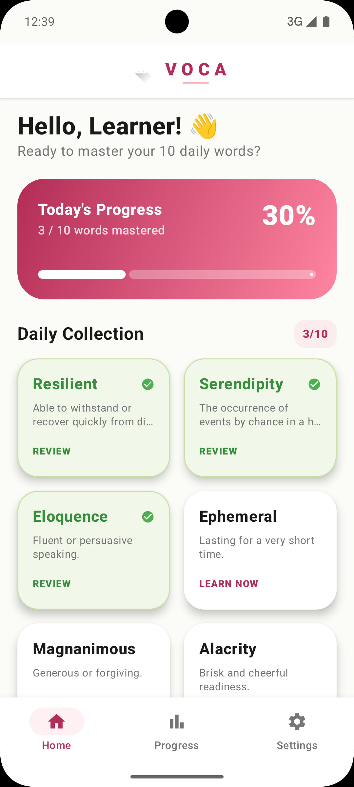
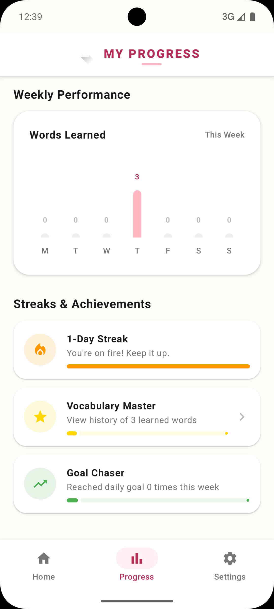
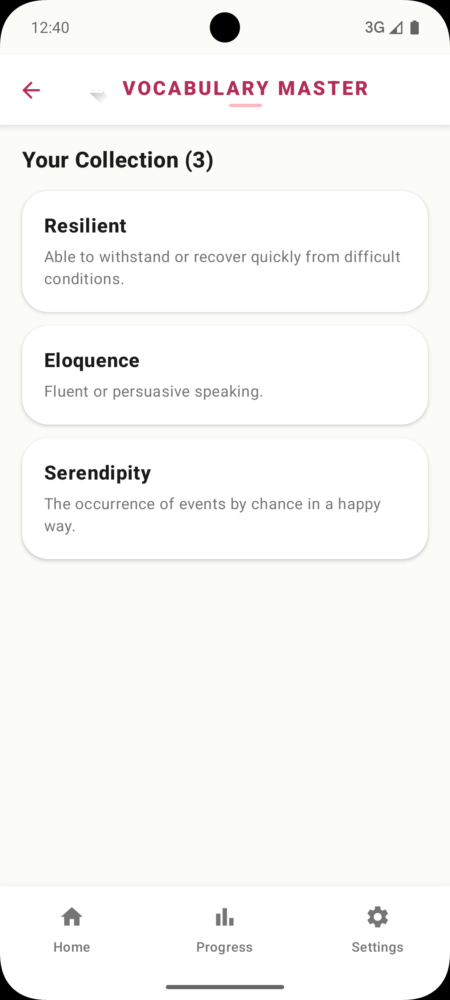
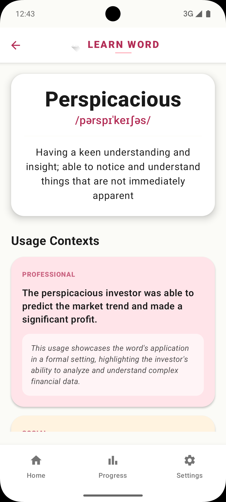

# Voca - AI-Powered Vocabulary Tutor 🚀

Voca is a modern Android application designed to help users master sophisticated English vocabulary. By leveraging **Large Language Models (LLMs)** and **Retrieval-Augmented Generation (RAG)** principles, Voca provides contextual learning experiences that go beyond simple definitions.

# Screenshots

## Home Screen



## My Progress Screen



## History Screen


## Word Detail Screen



## 🛠 Tech Stack
Voca is built with the latest industry standards to ensure a fast, reactive, and maintainable experience:

*   **Language**: [Kotlin](https://kotlinlang.org/) - 100% type-safe and expressive.
*   **UI Framework**: [Jetpack Compose](https://developer.android.com/compose) - Modern declarative UI with Material 3.
*   **Architecture**: **MVVM** (Model-View-ViewModel) - Clean separation of concerns.
*   **Dependency Injection**: **Dagger Hilt** - For scalable and robust dependency management.
*   **AI Integration**: **LLM** (Llama 3.3-70b via Groq) & **RAG** principles - Powering contextual retrieval and linguistic intelligence.
*   **Persistence**: **Jetpack DataStore** - Modern, reactive local storage for user progress.
*   **Networking**: **Retrofit & OkHttp** - Reliable and efficient API communication.

## 🌟 Key Features
- **AI Word Discovery**: Dynamically generates sophisticated daily words using advanced LLMs.
- **Contextual Learning**: Provides 3 distinct usage scenarios (Professional, Social, Creative) for every word to ensure deep understanding.
- **Mastery Tracking**: Persistent progress tracking to monitor your learning journey and streak.
- **Modern Experience**: A seamless, reactive UI with adaptive Material 3 components.

## 🧠 AI Implementation
Voca acts as a linguistics expert by utilizing:
- **Groq Cloud API**: High-speed LLM inference for real-time learning.
- **Smart Prompting**: Delivers structured JSON data ensuring a consistent mobile experience.
- **Domain Context**: RAG-inspired prompting ensures words are relevant to specific real-world domains.

## 📦 Getting Started
1. **Clone the Repo**:
   ```bash
   git clone https://github.com/komalbajoria22/Voca.git
   ```
2. **Open in Android Studio**: Open the root folder and wait for Gradle sync to finish.
3. **Run**: Press **Shift + F10** or the **Run** icon to build and launch on your device.

---
Built with ❤️ by [komalbajoria22](https://github.com/komalbajoria22)
